# StarWars Episode 1: Racer Multiplayer Fan Game

## Description

This is a personal project that I have been working on for some months as a solo developer. I was inspired by the classic Star Wars Episode I: Racer game from 1999 and wanted to be able to play it with better graphics and visuals. I came across RobJin's fantastic work and wanted to try and make it myself. The result has been a multiplayer game that allows up to 4 players through LAN, and as of now there is a simplified version of the Mos Espa Tatooine map. You can play as Anakin in his podracer with 4 different skins available for multiplayer. 

My game includes sound effects and soundtracks. It also supports joystick controllers in addition to keyboard.

Modeling, texturing, rigging and animation was done in Autodesk Maya. The programming, effects, and the game itself was made in Unreal Engine 4.

Here is a very short gif of the final product:

### - [Youtube Video](https://www.youtube.com/watch?v=9dATwSaVTCg)
### - [Game Download (MEGA)](https://mega.nz/file/ghclTYpQ#OW57o3GzZr-_kXqgvXCZOKP-XuNZJzQukDkgMI9lAWI) OR download the compiled game from the releases page of this repository
### - More screenshots available on my [Artstation page](https://www.artstation.com/artwork/Ga5x01)

## Notes
- The code available in this repository is a Hover Car Demo I made using Unreal Engine 4. 
- Use arrow keys to drive. 
- It has realistic hover physics that allow you to "float" and move around, and is an earlier version of the game I made.
- Compilied version of this demo is available in releases page of this repository.
- Example of this demo can be found in this readme file by looking at point #5 of "The Making of the Game".

## Screenshots
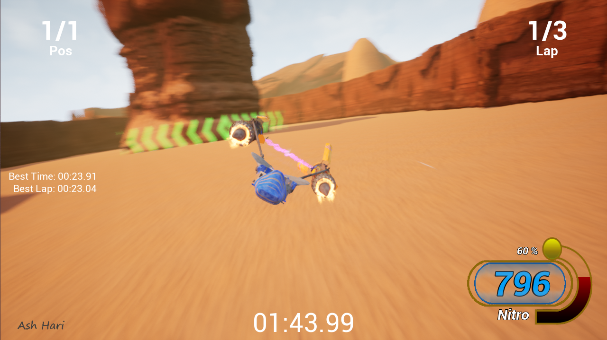
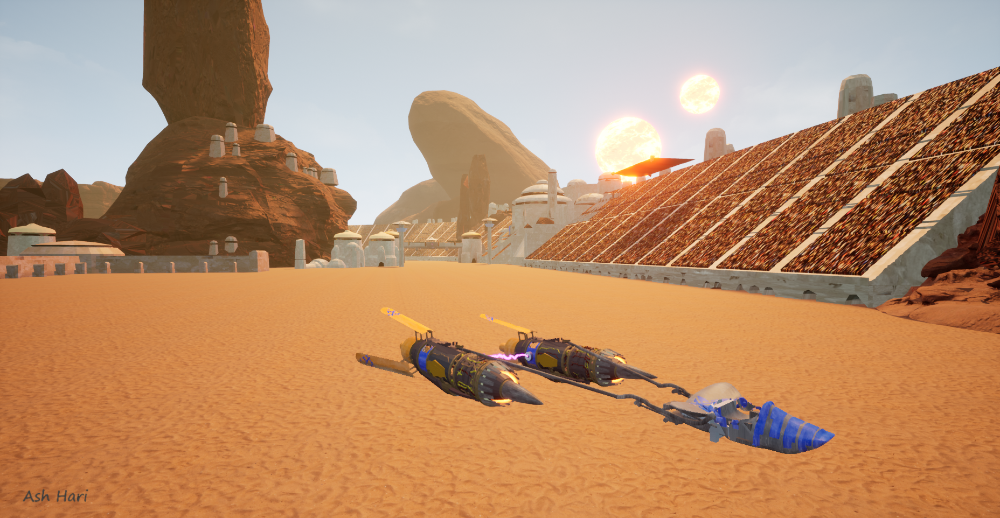
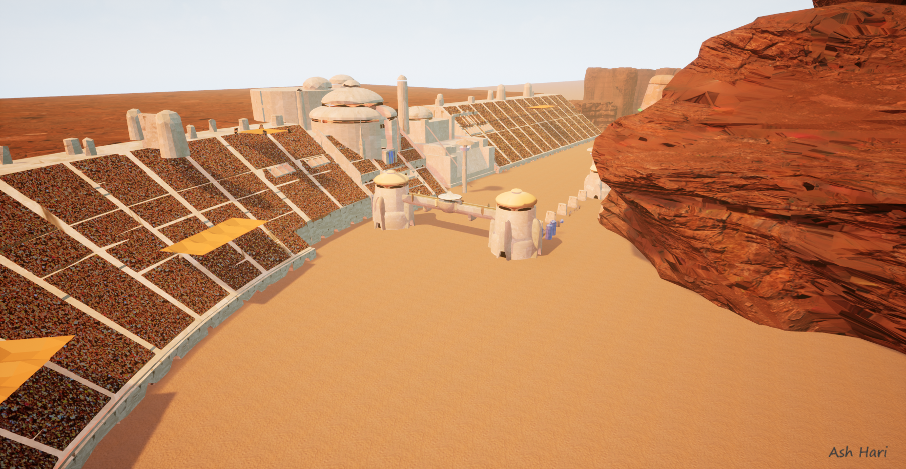

## The Making of the Game
1. I first started with the basic third person template in Unreal Engine.

2. Then I followed 2 tutorials ([Hover Tutorial 1](https://www.youtube.com/watch?v=cPVaDndT7tY) and [Hover Tutorial 2](https://www.youtube.com/watch?v=ko6lDSSNhV8)) on how to create the hover physics that was needed for my game (it used damping and vectors to make it possible, and I had to continuously make adjustments to the physics as I worked on this project so that the gameplay had a nice feel to it). (The 4 red lines under the hover "block" are a visualization of the hover forces that are being applied):               

3. The next thing I did was importing a hover car model that I found online (on [TurboSquid](https://www.turbosquid.com)) and replacing the rectangular block with the new hover car. As I was doing so, I found out that in order to do the animations which I would need to do later on, I would need it to be a skeletal mesh, which meant that instead of the hover car being one part, it would have multiple that would attach together. So I needed see how it would work, which I tested out on the hover car.

4. I then added acceleration curves and got the car to accelerate and deaccelerate. At first, I had a curve like the picture below (the curve is like the traditional Star Wars Racer game, where the pod would accelerate all of a sudden. I had this type of acceleration for quite a while):                              
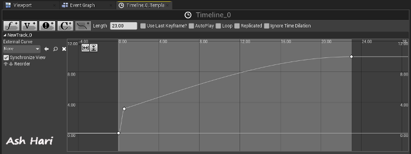

- I later on decided to change to a curve like this one below as it felt more realistic:
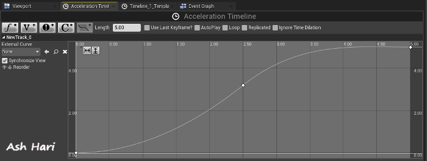
- Code Snippet: Acceleration
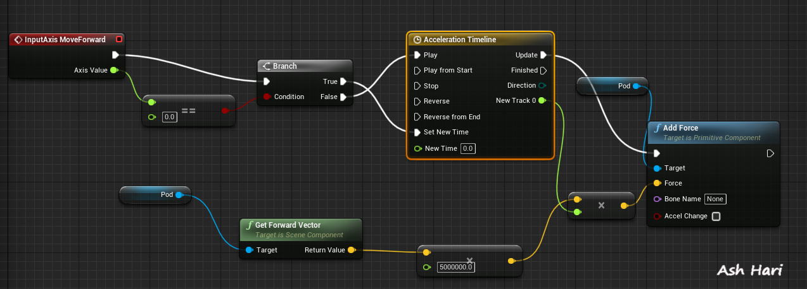

5. Then I add some scenery to the game (like some canyons) to see how that would work (canyon assets from [Quixel](https://quixel.com/)). I had to figure out how to do collision settings and such.

- Below is a screenshot showing all the surfaces on a single canyon block (blue lines show edges of surfaces):
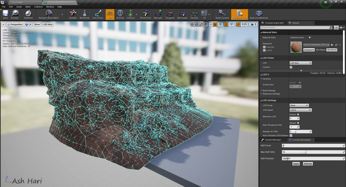
- Code Snippet: Reaction of pod when it hits another object:

6. The next thing to do was to replace the hover car with a Pod Racer model. After looking for a Pod Racer model online, I found one on [Sci-Fi 3D](http://www.scifi3d.com/), and attempted to import it into Unreal Engine. I found that there was a lot of bugs and fixes needed to be made to the pod such as the pod was not textured properly and it had many "holes" that shouldn't be there.               
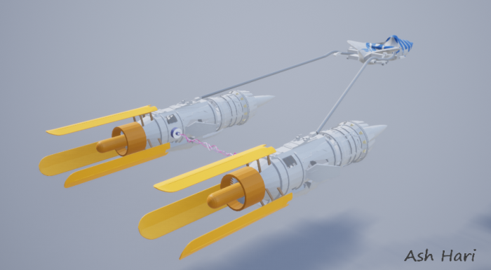

7. The next thing I did was remodeling, and retexturing the Pod Racer in Autodesk Maya. I also rigged and animated the pod so that it came it life. I made moving thruster animations, the 2 engines moving seperately animations, and the tilt animations (which I got the idea of having the tilt be the animations instead of the pod actually rotate from this [video](https://www.youtube.com/watch?v=LYqc1cEYIE0)). Below is a picture of the animations being played in Autodesk Maya (the colorful shapes sticking out of the pod is a visualization of the bone structure I made for the rigging and animating):                       
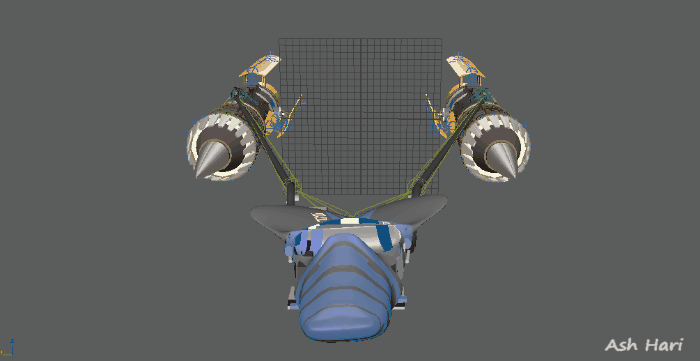
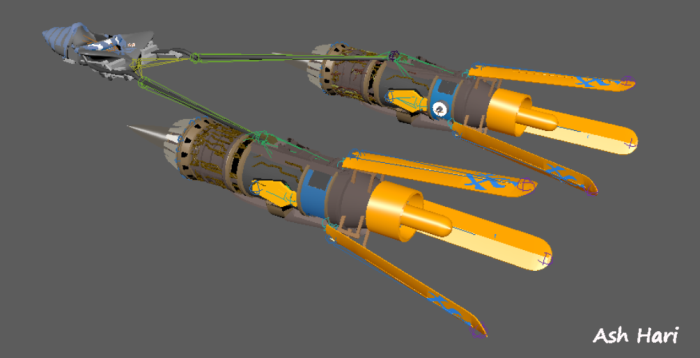
- I also added metal and dirt textures later on to make it look more real:                  
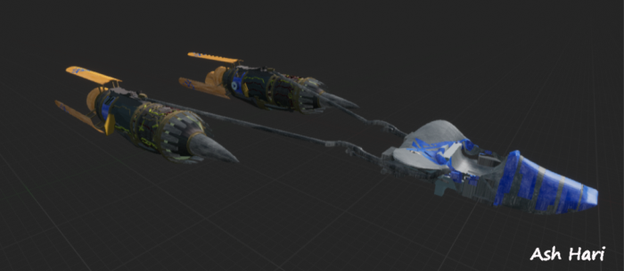

8. I reimported the model now with the animations (which I had to learn how), and attempted to add them to the turning of the pod, the idle position of the pod and so on. The idle pose was fairly easy to do, but the tilting of the pod when turning, was not such a simple task. The logic of the tilting animation should have worked in a way that, based on how much you are turning left and right (on a keyboard it is digital (goes directly from 0 to 1/-1), but on a joystick it is analog (goes from 0 to 1/-1 smoothly), the pod should tilt respectively. I tried to fake it first as I had no idea how to tilt it based on the turn amount, and I did it so that it should tilt fully left if left is pressed, or fully right if right pressed, there was no inbetween tilt position. Though this seemed to work, it caused a lot of problems and it would not work nicely on a joystick (which this game is meant to be played on). I eventually found out that the way to do it was to use a "Get Angular Velocity" node inbuilt into Unreal Engine, which allowed me to get how much the player turned. This worked perfectly and allowed the joystick to also work properly. Below is the Blendspace I made in Unreal Engine, which shows what happens when the value of the joystick equals 0, 1, or -1:

9. After that, I created the beam that goes across the 2 pod engines using Niagara particle effects. Niagara is built into Unreal Engine and is a particle generator used for visual effects. I set the 2 ends of the beam to attach to the 2 parts of the pod the beam should go across. The glowing engine fire is also created through Niagara particle effects.
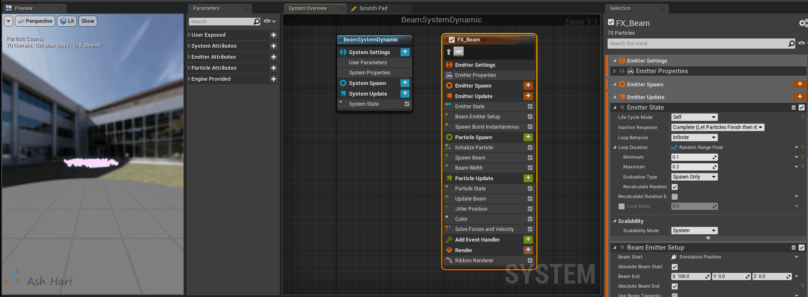
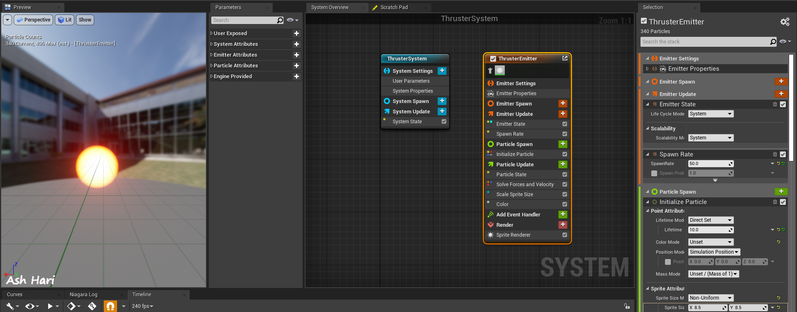

10. The next thing to do was to add boost/Nitro. I added in a Nitro System (that refills as you race) (modifed from this [nitro tutorial](https://www.youtube.comnwatch?v=XFrsQmRJEOE)), and flames that come out of the pod engine while boosting. I also made a camera lag system, where the Pod gets ahead of the camera as the player accelerates, and the camera gets even further away when the player boosts. I also made the camera lag a bit while turning based on how much the player turns. Below is a code snippet for the nitro system:
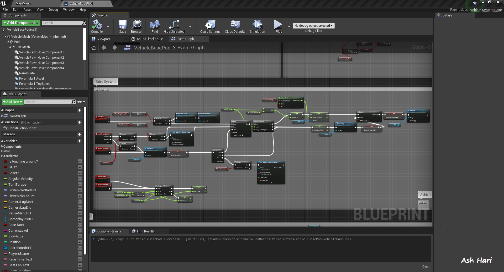

11. One of the main purposes of this project, was to be able to play and learn about multiplayer. So after adding in more scenery, the Pod Racing Arena, and things like creating textured suns for Tatooine, I found this [great multiplayer tutorial series](https://www.youtube.com/watch?v=Vw3d9Kwd6v8&list=PLM5xJtuLgIuz1NQcei5lE09TY5M4CMOwA&index=2) to learn about multiplayer, how it works, and how to create multiplayer in Unreal Engine. As I followed along, I had to make sure of things like, make sure it is a "pawn" type class (which is what my Pod Racer was), not a "character" (3rd person default player). After completing the tutorial series, I found a problem: some players could not see other Pods, and some players could not move around at all. I also wanted the physics to be run client-side which would allow for low-latency gameplay as one computer would not be taking all the load. After taking time to learn how client / server works and how replication works, I was finally able to get the all players to see each other, move around, and not lag.

- Code snippet: Replicating position and rotation for multiplayer:
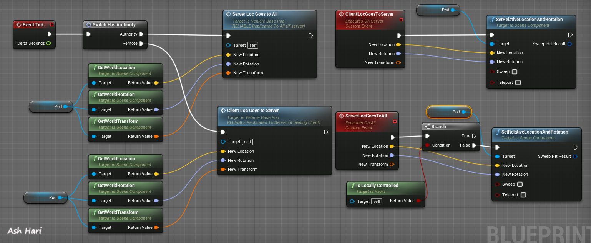
- I also got nametags working so that you are able to see who is racing which pod. (modified a lot from this [nametag tutorial](https://www.youtube.com/watch?v=IK31q8H2Y2M)):

12. While also working on multiplayer, I did the menu system, where you are able to host and find a match, and change game settings. After creating/joining the session, there is a lobby where the players can pick there pods and move around, and the host can pick the map and the number of laps. In-game, there is a pause menu where you can see controls, change game settings, and quit.
- Main menu:             
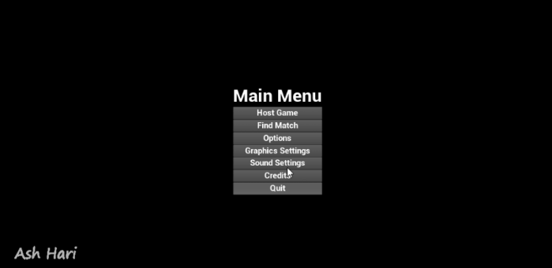
- Lobby:           

- Pause Menu:             
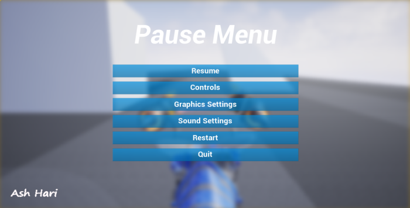

13. I wanted the Pod Racer to have engine sounds and acceleration sounds so I took parts from different videos, like [this](https://www.youtube.com/watch?v=CJMfjzQ2lcs), lowered the pitch by a lot (so that is sounded more like jet engines), and set them up to play at the appropriate times. The different sound effects also followed a similiar procedure, where I would find a sound, change the pitch and volume accordingly, and then program it to play at the correct time. Below is a code snippet for fading in the sound for when the pod has reached its top speed:

- Code snippet: Replicating the sound of your pod (using server-client programming) to the other players so that they are able to hear you and you can hear them:

14. The last piece of the project was creating the race mechanics (like laps, timer, and checkpoints). I found this [amazing racing gamemode tutorial series](https://www.youtube.com/watch?v=VJj6rQpktyI&list=PLZlv_N0_O1gYdhCvvMKGpCF6LCgBz9XeS) which was really helpful and allowed me to create the game mode I needed. I had to change many things to get it working with multiplayer as the tutorial was only meant for a single player. Below is a code snippet of the lap and race timer code which is used during the race:                     
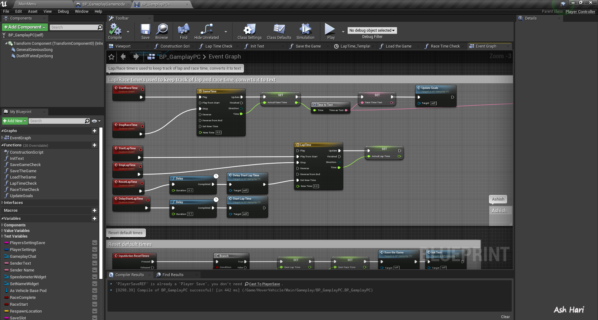
- Another thing I did while doing the race mechanics was the Heads Up Display. I put in a timer, the players position, lap number, and the best race time. I also added a custom speedometer (that looks like the original Pod Racing game), and a bar for Nitro. Below is a desgin layout of the in-game HUD: 
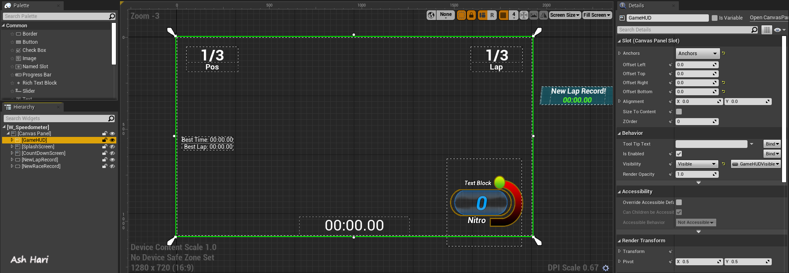
- I also added in the positioning system, where you can tell what place you are in live in-game. I did this by checking who has passed a certain marker (overlap box) first, and then sending the data to other PCs so that they can determine the players position. Below is a code snippet for getting the players position based on how many players have passed a certain marker in the game:

- A ranking system was also put into place so the player is able to see who is in what position live in-game (modified a lot from [this tutorial](https://www.youtube.com/watch?v=frpBJ_R4CmY)). 
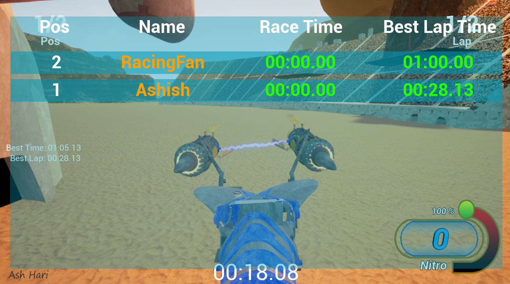

15. Here is a very short gif of the final product:

- [Youtube Video](https://www.youtube.com/watch?v=9dATwSaVTCg)
- [Game Download (MEGA)](https://mega.nz/file/ghclTYpQ#OW57o3GzZr-_kXqgvXCZOKP-XuNZJzQukDkgMI9lAWI) OR download the compiled game from the releases page of this repository
- More screenshots available on my [Artstation page](https://www.artstation.com/artwork/Ga5x01)

Copyright Disclaimer:

THE CONTENT IS FOR ENTERTAINMENT PURPOSE ONLY. IT IS NOT FOR SALE OR MONETIZATION. IT IS NOT ASSOCIATED OR ENDORSED BY DISNEY, LUCASFILM, OR ANY OTHER AFFILIATED COMPANIES. ALL CHARACTERS, NAMES, AND REFERENCES ARE COPYRIGHT AND TRADEMARK OF THEIR RESPECTIVE HOLDERS.
